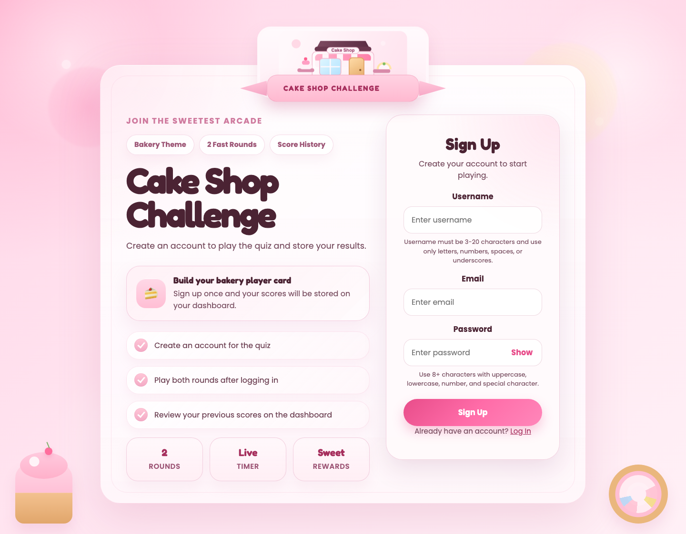
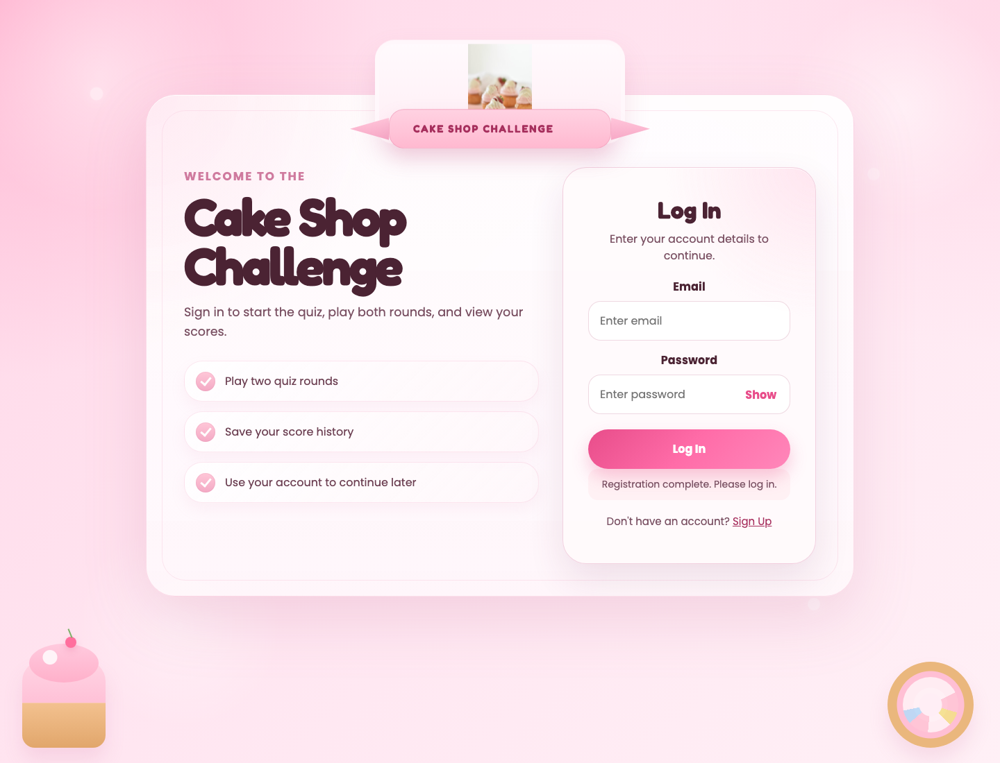
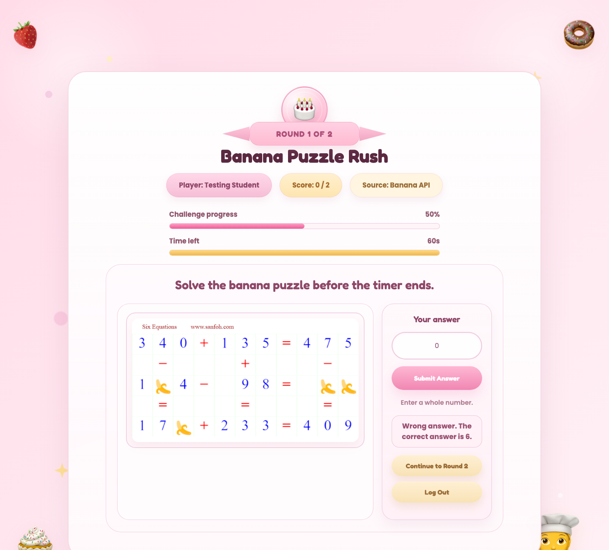
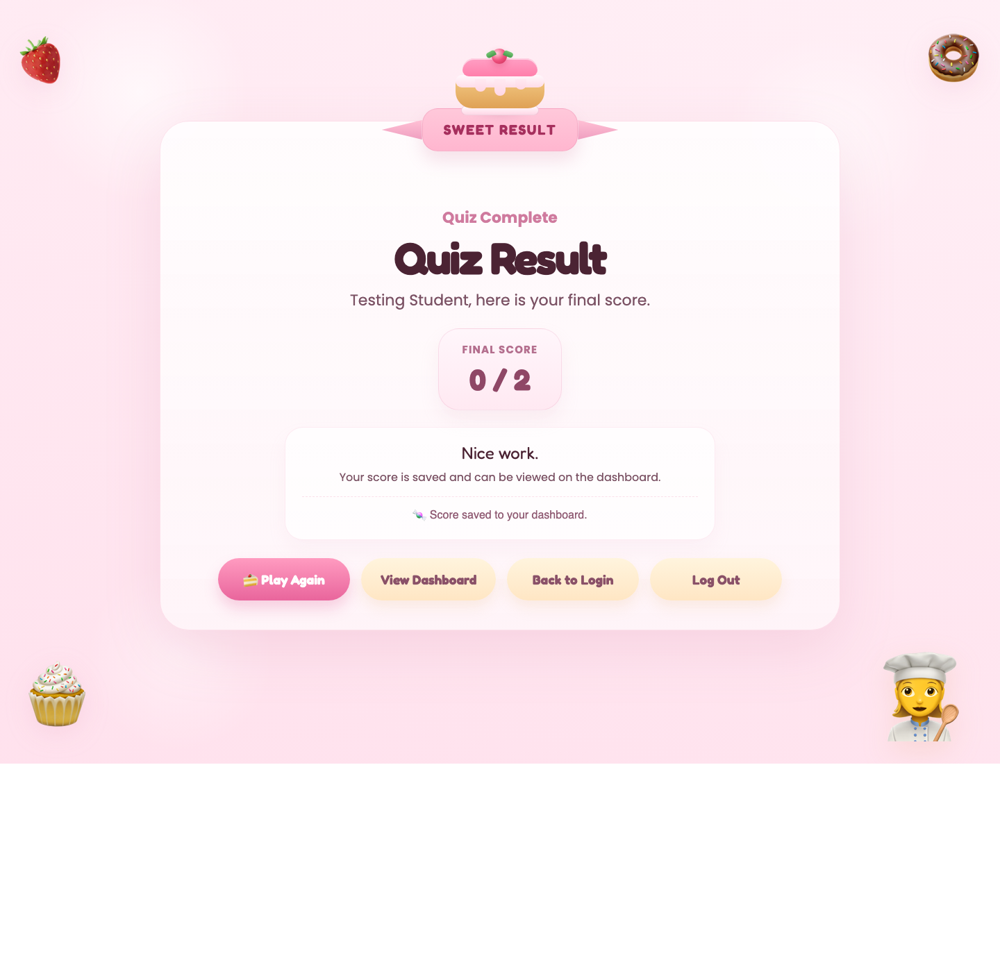
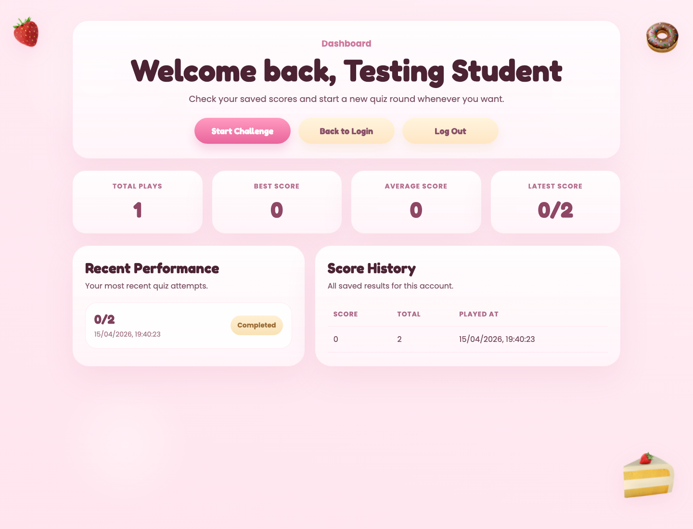

# Manual Testing Evidence

This document records manual testing evidence for the Cake and Baking Quiz Game.
It can be submitted as supporting material with the assignment video and source code.

## Test Environment

- Test date: 15 April 2026
- Browser used: Google Chrome 147.0.7727.56
- Frontend: React + Vite
- Backend: FastAPI + SQLite
- Local frontend URL used for evidence: `http://localhost:5173`
- Local backend URL used for evidence capture: `http://127.0.0.1:8001`
- Test account: `testing-1776262211493@example.com`
- Test result: Pass

The evidence run registered a new user, logged in, completed a quiz attempt, saved the
result, and opened the dashboard to confirm that the score history was stored.

## Screenshot Evidence

### Register Page

Evidence that the registration screen loads and provides username, email, and password
fields for creating a virtual identity.

Result: Pass.

### Login Page

Evidence that the login screen loads after registration and accepts the test account
credentials.

Result: Pass.

### Quiz Working

Evidence that the protected quiz page loads after login, starts the challenge, displays
the timer, accepts an answer, and moves through the event-driven quiz flow.

Result: Pass.

### Result Page

Evidence that the result page displays the final score and confirms that the score was
saved to the dashboard.

Result: Pass.

### Dashboard With Saved Scores

Evidence that the dashboard loads for the authenticated user and displays saved score
history/statistics from the backend database.

Result: Pass.

## Manual Test Results

| Area | Test | Expected result | Actual result | Status |
| --- | --- | --- | --- | --- |
| Authentication | Register a new user with valid username, email, and strong password | Account is created and user is redirected to login | User was registered and login screen was shown | Pass |
| Authentication | Log in with the new account | Session is created and protected pages become available | Login succeeded and dashboard was accessible | Pass |
| Virtual identity | Open protected pages while logged in | User identity is restored from the active session | Quiz, result, and dashboard pages were accessible | Pass |
| Event-driven quiz | Start the challenge and submit a banana answer | UI responds to click/input events and shows feedback | Quiz accepted the answer and allowed progress to round 2 | Pass |
| Event-driven quiz | Select a dessert answer and finish the challenge | UI responds to answer selection and finishes the quiz | Dessert answer was accepted and result page opened | Pass |
| Persistence | Save score after completing quiz | Score is stored against the logged-in user | Result page showed score saved confirmation | Pass |
| Dashboard | Open dashboard after saved result | Saved score history/statistics are visible | Dashboard displayed saved score information | Pass |
| Interoperability | Load quiz/result data through backend APIs | Frontend communicates with backend and backend uses API/fallback data | Quiz and result pages loaded successfully | Pass |

## Notes For Video Discussion

- These screenshots can be shown briefly in the video as proof that the implementation works.
- The register/login/dashboard screenshots support the virtual identity discussion.
- The quiz screenshot supports the event-driven programming discussion.
- The result/dashboard screenshots support persistence and frontend/backend interoperability.
- The backend source comments and README acknowledge the external APIs and assets used by the application.
